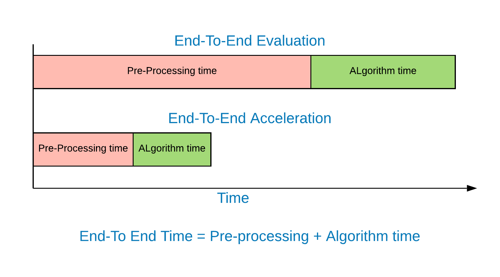

# AccelGraph
## Graph Processing Framework With OpenMP/CAPI-SNAP/Verilog

AFU framework for Graph Processing algorithms with CAPI connected FGPAs With Verilog/OpenMP/Shared Memory Accelerator CAPI

## Overview



AccelGraph is an open source Graph processing framework, it is designed to be a portable benchmarking suit for various graph processing algorithms. The OpenMP part has been tested on Ubuntu 18.04 with PowerPC/Intel architecture taken into account. It is coded using C giving the researcher full flexibility with coding data structures and other algorithmic optimizations. Furthermore this benchmarking tool has been fully integrated with CAPI, demonstrating the contrast in performance between using shared memory FPGA with parallel processors.

## Organization

* `00_Graph_OpenMP`
  * `include` - System Verilog architectures
    * `graphalgorithms` - \Implemented Graph algorithm
      * `BFS.h` - Breadth First Search
      * `DFS.h` - Depth First Search
      * `SSSP.h` - Single Source Shortest Path
      * `bellmanFord.h` - Single Source Shortest Path using Bellman Ford
      * `incrementalAgreggation.h` - Incremental Aggregation for clustering
      * `pageRank.h` - Page Rank Algorithm
    * `preprocessing` - preprocessing graph algorithms [Presentation](./02_slides/preprocessing_Graphs_countsort.pdf)
      * `countsort.h` - sort edge list using count sort
      * `radixsort.h` - sort edge list using radix sort
      * `reorder.h` - cluster reorder the graph for better cache locality
      * `sortRun.h` - chose which sorting algorithm to use
    * `structures` - structures that hold the graph in memory [Presentation](./02_slides/Graph_DataStructures.pdf)
      * `graphAdjArrayList.h` - graph using adjacency list array with arrays
      * `graphAdjLinkeList.h` - graph using adjacency list array with linked lists
      * `graphCSR.h` - graph using compressed sparse matrix
      * `graphGrid.h` - graph using Grid

* *`Makefile`* - Global makefile

## Details

### Graph Algorithm Supported Implementations

### Initial compilation for the Graph frame work with OpenMP

1. From the root directory you can modify the Makefile with the parameters you need
  ```bash
  make 
  make run
  ```

2. Run the algorithm with the data structure and other settings you need
  ```bash
Usage: ./main -f <graph file> -d [data structure] -a [algorithm] -r [root] -n [num threads] [-h -c -s -w]
  -h [Help] 
  -a [algorithm] : [0]-BFS, [1]-Pagerank, [2]-SSSP-DeltaStepping, [3]-SSSP-BellmanFord, [4]-DFS [5]-IncrementalAggregation
  -d [data structure] : [0]-CSR, [1]-Grid, [2]-Adj LinkedList, [3]-Adj ArrayList [4-5] same order bitmap frontiers
  -r [root]: BFS, DFS, SSSP root
  -p [algorithm direction] [0-1]-push/pull [2-3]-push/pull fixed point arithmetic [4-6]-same order but using data driven
  -o [sorting algorithm] [0]-radix-src [1]-radix-src-dest [2]-count-src [3]-count-src-dst.
  -n [num threads] default:max number of threads the system has
  -i [num iterations] number of iterations for pagerank to converge [default:20] SSSP-BellmanFord [default:V-1] 
  -t [num trials] number of random trials for each whole run [default:0]
  -e [epsilon/tolerance] tolerance value of for page rank [default:0.0001]
  -l [mode] lightweight reordering [default:0]-no-reordering [1]-pagerank-order [2]-in-degree [3]-out-degree [4]-in/out degree [5]-Rabbit  
  -c: read text format convert to bin file on load example:-f <graph file> -c
  -w: Weight generate random or load from file graph check graphConfig.h #define WEIGHTED 1 beforehand then recompile with using this option
  -s: Symmetric graph, if not given set of incoming edges will be created 
  -b: SSSP Delta value [Default:1]  
```

### CAPI SNAP

* For Deeper understanding of the SNAP framework: https://github.com/open-power/snap
* CAPI and SNAP on IBM developerworks: https://developer.ibm.com/linuxonpower/capi/  
* [IBM Developerworks Forum, tag CAPI_SNAP (to get support)](https://developer.ibm.com/answers/smartspace/capi-snap/index.html)
* [Education Videos](https://developer.ibm.com/linuxonpower/capi/education/)
