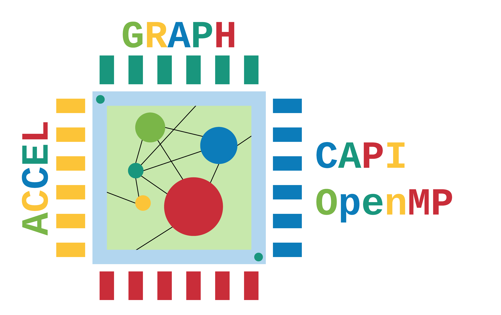
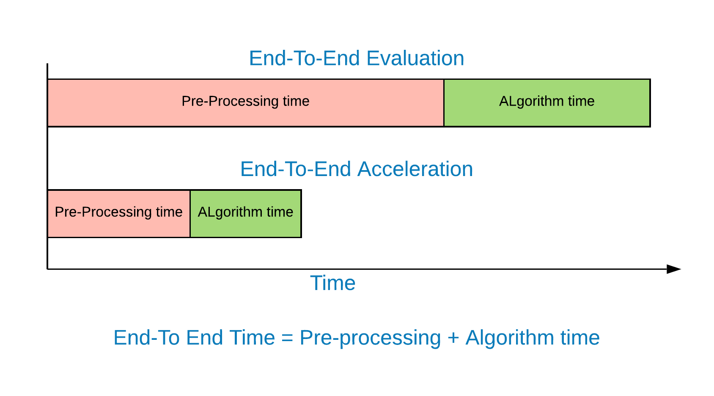
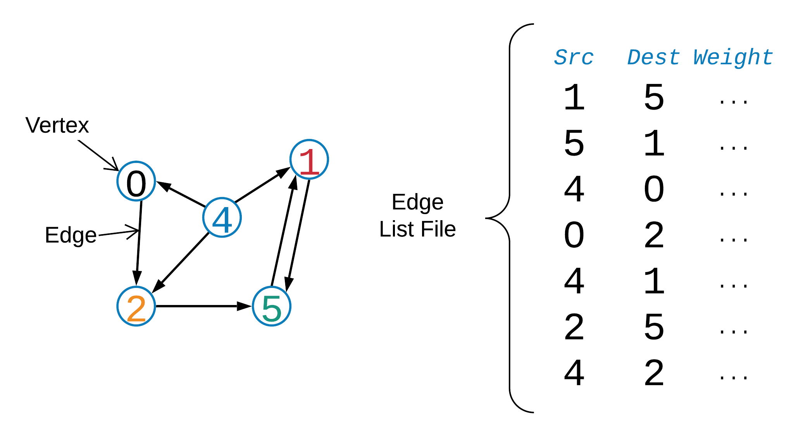
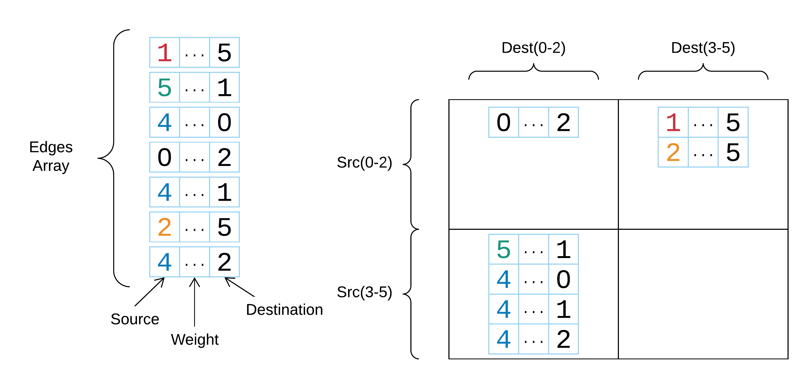
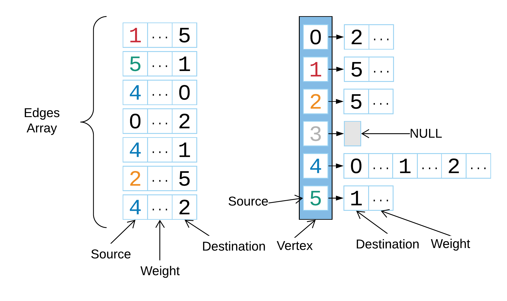
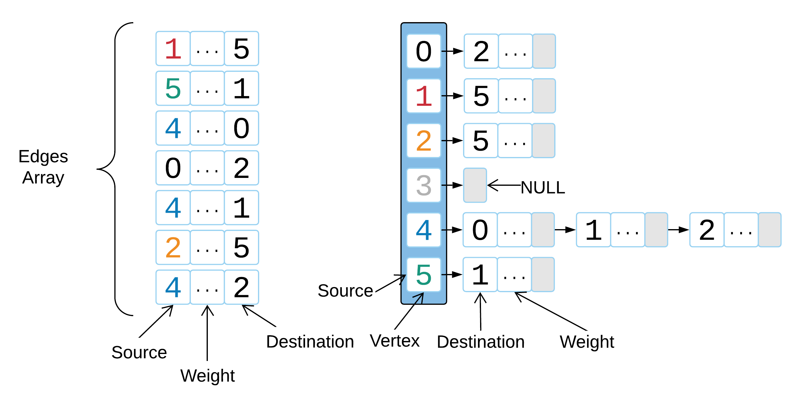
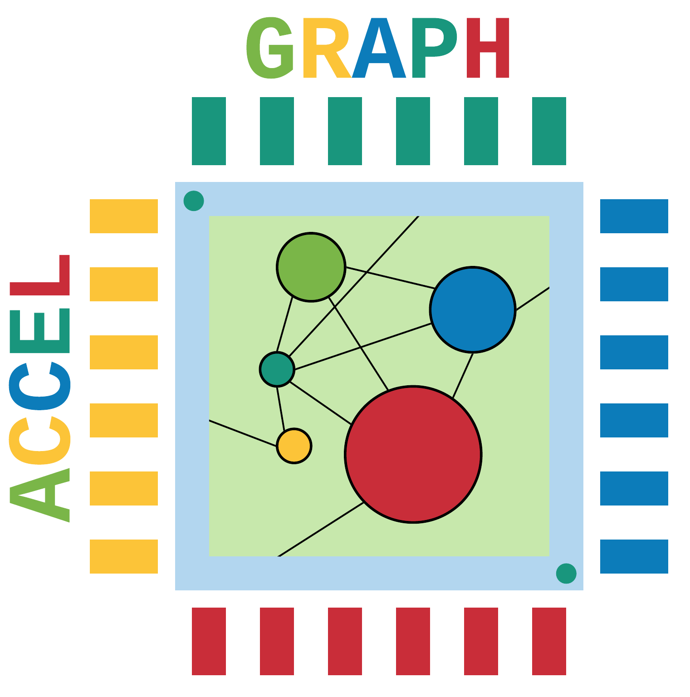

[](https://travis-ci.com/atmughrabi/AccelGraph)
[<p align="center"></p>](#accel-graph-benchmark-suite)

# Accel-Graph Benchmark Suite

## Graph Processing Framework that supports | OpenMP || CAPI/SystemVerilog || gem5-Aladdin | 

## Overview 



Accel-Graph is an open source graph processing framework. It is designed as a modular benchmarking suite for graph processing algorithms. It provides an end to end evaluation infrastructure which includes the preprocessing stage of forming the graph structure and the graph algorithm. The OpenMP part of Accel-Graph has been developed on Ubuntu 16.04.6, with PowerPC/Intel architecture taken into account. 
Accel-Graph is coded using C giving the researcher full flexibility with modifying data structures and other algorithmic optimizations. Furthermore, this benchmarking suite has been fully integrated with IBM Coherent Accelerator Processor Interface (CAPI), demonstrating the contrast in performance between Shared Memory Accelerators and Parallel Processors. Also, we support gem5-Aladdin for pre-RTL performance exploration using accelerators. Included also, a simple cache model hard-coded into our base code for quick and dirty cache performance evaluation.

* Presentations that explains end-to-end graph processing
  * Preprocessing two steps (third one is optional) :
    1. [[Sorting the edge-list](./02_slides/02_preprocessing_countsort.pdf)], using count-sort or radix-sort.
    2. [[Building the graph structure](./02_slides/03_preprocessing_DataStructures.pdf)]. CSR, Gird, Adjacency-Linked-List, and Adjacency-Array-List. 
        * [Ref](https://github.com/thu-pacman/GridGraph): Xiaowei Zhu, Wentao Han and Wenguang Chen. [GridGraph: Large-Scale Graph Processing on a Single Machine Using 2-Level Hierarchical Partitioning](https://www.usenix.org/system/files/conference/atc15/atc15-paper-zhu.pdf). Proceedings of the 2015 USENIX Annual Technical Conference, pages 375-386.
        * [Ref](https://github.com/epfl-labos/EverythingGraph): Malicevic, Jasmina, Baptiste Lepers, and Willy Zwaenepoel. "Everything you always wanted to know about multicore graph processing but were afraid to ask." 2017 USENIX Annual Technical Conference. Proceedings of the 2015 USENIX Annual Technical Conference, pages 375-386.
    3. [[Relabeling the graph](./02_slides/01_algorithm_PR_cache.pdf)], this step achieves better cache locality (better performance) with preprocessing overhead.
        * [Ref](https://github.com/araij/rabbit_order): J. Arai, H. Shiokawa, T. Yamamuro, M. Onizuka, and S. Iwamura. Rabbit Order: Just-in-time Parallel Reordering for Fast Graph Analysis. IEEE International Parallel and Distributed Processing Symposium (IPDPS), 2016.
  * Graph Algorithm step depends on the direction of the data (Push/Pull):
    1. [[BFS example](./02_slides/00_algorithm_BFS.pdf)], although it doesn't show direction optimized. But we discusses the Push and Pull approach separately.
        * [[Ref](https://github.com/sbeamer/gapbs)]: Scott Beamer, Krste Asanović, David Patterson. [The GAP Benchmark Suite](http://arxiv.org/abs/1508.03619). arXiv:1508.03619 [cs.DC], 2015.
    2. [[Page-Rank (PR) example](./02_slides/01_algorithm_PR_cache.pdf)]: Discussing PR cache behavior.
       * [Ref](https://github.com/araij/rabbit_order): J. Arai, H. Shiokawa, T. Yamamuro, M. Onizuka, and S. Iwamura. Rabbit Order: Just-in-time Parallel Reordering for Fast Graph Analysis. IEEE International Parallel and Distributed Processing Symposium (IPDPS), 2016.

<!-- ## Details -->
<!-- ### Accel-Graph Supported Algorithms -->

# Installation 

## Dependencies

### OpenMP
1. Judy Arrays
```console
accel@graph:~$ sudo apt-get install -y libjudy-dev
```
2. OpenMP is already a feature of the compiler, so this step is not necessary.
```console
accel@graph:~$ sudo apt-get install libomp-dev
```

### gem5-Aladdin
1. Please refer to [(gem5-Aladdin)](https://github.com/harvard-acc/gem5-aladdin), read the papers to understand the big picture `HINT: check their docker folder for an easy setup`.

### CAPI
1. TODO

## Setting up the source code 

1. Clone Accel-Graph.
```console
accel@graph:~$ git clone https://github.com/atmughrabi/AccelGraph.git
```
2. From the home directory go to the AccelGraph directory:
```console
accel@graph:~$ cd AccelGraph/
```
3. Setup the CAPI submodules.

```console
accel@graph:~AccelGraph$ git submodule update --init --recursive
```

# Running Accel-Graph 

[](https://www.openmp.org/)

## Initial compilation for the Graph framework with OpenMP 

1. (Optional)From the root directory go to the graph benchmark directory:
```console
accel@graph:~AccelGraph$ cd 00_graph_bench/
```
2. The default compilation is `openmp` mode:
```console
accel@graph:~AccelGraph/00_graph_bench$ make 
```
3. From the root directory you can modify the Makefile with the [(parameters)](#accel-graph-options) you need for OpenMP:
```console
accel@graph:~AccelGraph/00_graph_bench$ make run
```
* OR
```console
accel@graph:~AccelGraph/00_graph_bench$ make run-openmp
```

[](https://github.com/harvard-acc/gem5-aladdin)

## Initial compilation for the Graph framework with gem5-Aladdin 

* NOTE: You need gem5-aladdin environment setup on your machine.
* Please refer to [(gem5-Aladdin)](https://github.com/harvard-acc/gem5-aladdin), read the papers to understand the big picture `HINT: check their docker folder for an easy setup`.
* It is best to go through some of the integration-test examples that [(Aladdin)](https://github.com/ysshao/aladdin/) provides. So you can understand the process flow of how and why things are proceeding the way they are.

### Running Aladdin 

1. (Optional)From the root directory go to the graph benchmark directory:
```console
accel@graph:~AccelGraph$ cd 00_graph_bench/
```
2. This will compile Aladdin, then generate a dynamic trace if it doesn't exist and then run Aladdin:
* The generated dynamic_trace resides in `./00_graph_bench/aladdin_common/dynamic_traces` 
* The dynamic trace is labeled with the following `(GRAPH_NAME)_(DATA_STRUCTURES)_(ALGORITHMS)_(PUSH_PULL)_dynamic_trace.gz`, this helps to distinguish between dynamic traces across different runs.
```console
accel@graph:~AccelGraph/00_graph_bench$ make run-aladdin
```
* OR (regenerates dynamic_trace even if it exists)
```console
accel@graph:~AccelGraph/00_graph_bench$ make run-aladdin-force 
```
* To generate a dynamic trace without running Aladdin: (if it never been generated)
```console
accel@graph:~AccelGraph/00_graph_bench$ make run-llvm-tracer 
```
* OR (regenerates dynamic_trace.gz even if it exist)
```console
accel@graph:~AccelGraph/00_graph_bench$ make run-llvm-tracer-force 
```

### Running gem5-Aladdin 

* NOTE: You need gem5-aladdin environment setup on your machine.
* AGAIN: Please refer to [(gem5-Aladdin)](https://github.com/harvard-acc/gem5-aladdin), read the papers to understand the big picture `HINT: check their docker folder for an easy setup`.
* gem5-Aladdin provides the possibility to evaluate the performance of shared memory accelerators.

1. (Optional)From the root directory go to the graph benchmark directory:
```console
accel@graph:~AccelGraph$ cd 00_graph_bench/
```
2. Their are four `mode` runs for gem5-aladding.
* Running with `openmp` mode on gem5 with the fully parallelized version of the graph algorithm.
```console
accel@graph:~AccelGraph/00_graph_bench$ make run-gem5-openmp
```
* Running with `cpu` mode on gem5 with a single threaded kernel extracted from the graph algorithm (the compute intensive one), this is according to gem5-Aladdin integration-test examples.
```console
accel@graph:~AccelGraph/00_graph_bench$ make run-gem5-cpu
```
* Running with `accel` mode on gem5 with the accelerator active. The performance model is derived from the DDDG (Dynamic Data Dependence Graph).
```console
accel@graph:~AccelGraph/00_graph_bench$ make run-gem5-accel
```
* Running with `cache` mode using `00_graph_bench/util/cache.c`.This simulates trace driven cache. check `pageRankPullGraphCSRKernelCache` in `00_graph_bench/src/gem5aladdin/pageRank_kernels.c`, for a good example.
```console
accel@graph:~AccelGraph/00_graph_bench$ make run-gem5-cache
```

[](https://openpowerfoundation.org/capi-drives-business-performance/)

## Initial compilation for the Graph framework with Coherent Accelerator Processor Interface (CAPI)  

* NOTE: You need CAPI environment setup on your machine.
* [CAPI Education Videos](https://developer.ibm.com/linuxonpower/capi/education/)
* We are not supporting CAPI-SNAP since our graph processing suite heavily depends on accelerator-cache. SNAP does not support this feature yet. So if you are interested in streaming applications or do not benefit from caches SNAP is a good candidate.
* For Deeper understanding of the SNAP framework: https://github.com/open-power/snap
* CAPI and SNAP on IBM developerworks: https://developer.ibm.com/linuxonpower/capi/  
* [IBM Developerworks Forum, tag CAPI_SNAP (to get support)](https://developer.ibm.com/answers/smartspace/capi-snap/index.html)


1. (Optional)From the root directory go to the graph benchmark directory:
```console
accel@graph:~AccelGraph$ cd 00_graph_bench/
```
2. Run [PSL Simulation Engine](https://github.com/ibm-capi/pslse) (PSLSE) for `simulation` this step is not needed when running on real hardware, this just emulates the PSL that resides on your (CAPI supported) IBM-PowerPC machine  :
```console
accel@graph:~AccelGraph/00_graph_bench$ make run-pslse
```
3. Runs a graph algorithm that communicates with the PSLSE (simulation), or PSL (real HW):
```console
accel@graph:~AccelGraph/00_graph_bench$ make run-capi
```

## Graph structure Input (Edge list) 

* If you open the Makefile you will see the convention for graph directories : `BENCHMARKS_DIR/GRAPH_NAME/graph.wbin`.
* `.bin` stands to unweighted edge list, `.wbin` stands for wighted, `In binary format`. (This is only a convention you don't have to use it)
* The reason behind converting the edge-list from text to binary, it is simply takes less space on the drive for large graphs, and easier to use with the `mmap` function.

| Source  | Dest | Weight (Optional) |
| :---: | :---: | :---: |
| 30  | 3  |  1 |
| 3  | 4  |  1 |

* Example: 
* INPUT: (unweighted textual edge-list)
* ../BENCHMARKS_DIR/GRAPH_NAME/graph
 ```
  30    3
  3     4
  25    5
  25    7
  6     3
  4     2
  6     12
  6     8
  6     11
  8     22
  9     27

 ```
* convert to binary format and add random weights, for this example all the weights are `1`.
* `--graph-file-format` is the type of graph you are reading, `--convert-format` is the type of format you are converting to. 
* NOTE: you can read the file from text format without the convert step. By adding `--graph-file-format 0` to the argument list. The default is `1` assuming it is binary. please check `--help` for better explanation.
* `--stats` is a flag that enables conversion. It used also for collecting stats about the graph (but this feature is on hold for now).
```console
accel@graph:~AccelGraph/00_graph_bench$ make convert
```
* OR
```console
accel@graph:~AccelGraph/00_graph_bench$ ./bin/accel-graph-openmp  --generate-weights --stats --graph-file-format=0 --convert-format=1 --graph-file=../BENCHMARKS_DIR/GRAPH_NAME/graph 
```

* OUTPUT: (weighted binary edge-list)
*  ../BENCHMARKS_DIR/GRAPH_NAME/graph.wbin
```
1e00 0000 0300 0000 0100 0000 0300 0000
0400 0000 0100 0000 1900 0000 0500 0000
0100 0000 1900 0000 0700 0000 0100 0000
0600 0000 0300 0000 0100 0000 0400 0000
0200 0000 0100 0000 0600 0000 0c00 0000
0100 0000 0600 0000 0800 0000 0100 0000
0600 0000 0b00 0000 0100 0000 0800 0000
1600 0000 0100 0000 0900 0000 1b00 0000
0100 0000 
```

# Graph Structure Preprocessing:
Accel-Graph can handle multiple representations of the graph structure in memory, each has their own theoretical benefits and shortcomings.

## Regular unsorted Edge-list as input.

<p align="center"></p>

##  CSR (Compressed Sparse Row)
<p align="center"></p>

##  Grid
<p align="center"></p>

##  Array-List
<p align="center"></p>

##  Linked-List
<p align="center"></p>


# Accel-Graph Options 

```
Usage: accel-graph [OPTION...]
            -f <graph file> -d [data structure] -a [algorithm] -r [root] -n
            [num threads] [-h -c -s -w]
AccelGraph is an open source graph processing framework, it is designed to be a
portable benchmarking suite for various graph processing algorithms.

  -a, --algorithm=[DEFAULT:0]   
                             [0]-BFS, [1]-Page-rank, [2]-SSSP-DeltaStepping,
                             [3]-SSSP-BellmanFord, [4]-DFS,[5]-SPMV,
                             [6]-Connected-Components, [7]-Triangle Counting,
                             [8]-IncrementalAggregation

  -b, --delta=[DELTA:1]      
                             SSSP Delta value [Default:1]

  -c, --convert-format=[TEXT|BIN|CSR:1]
                             [stats flag must be on --stats to write]Serialize
                             graph text format (edge list format) to binary
                             graph file on load example:-f <graph file> -c this
                             is specifically useful if you have Graph CSR/Grid
                             structure and want to save in a binary file format
                             to skip the preprocessing step for future runs.
                             [0]-text edgeList [1]-binary edgeList [2]-graphCSR
                             binary

  -d, --data-structure=[DEFAULT:0]
                             [0]-CSR, [1]-Grid, [2]-Adj LinkedList, [3]-Adj
                             ArrayList

  -e, --tolerance=[EPSILON:0.0001], --epsilon=[EPSILON:0.0001]
                             Tolerance value of for page rank [default:0.0001]
                            
  -f, --graph-file=<FILE>    
                             Edge list represents the graph binary format to
                             run the algorithm textual format change
                             graph-file-format

  -g, --bin-size=SIZE:512    
                             You bin vertices's histogram according to this
                             parameter, if you have a large graph you want to
                             illustrate 

  -i, --num-iterations=[DEFAULT:20]
                             
                             Number of iterations for page rank to converge
                             [default:20] SSSP-BellmanFord [default:V-1] 

  -j, --in-out-degree=[DEFAULT:2]
                             
                             [1]-in-degree, [2]-out-degree, bin histogram with
                             out/in-degree binned. [DEFAULT:2]  

  -k, --remove-duplicate     
                             Removers duplicate edges and self loops from the
                             graph

  -l, --light-reorder=[ORDER:0]   
                             Relabels the graph for better cache performance.
                             [default:0]-no-reordering [1]-page-rank-order
                             [2]-in-degree [3]-out-degree [4]-in/out degree
                             [5]-Rabbit [6]-Epoch-pageRank [7]-Epoch-BFS
                             [8]-LoadFromFile 

  -n, --num-threads=[DEFAULT:MAX]
                             Default:max number of threads the system has

  -o, --sort=[DEFAULT:0]     
                             [0]-radix-src [1]-radix-src-dest [2]-count-src
                             [3]-count-src-dst

  -p, --direction=[DEFAULT:0]   
                             [0]-PULL, [1]-PUSH,[2]-HYBRID. NOTE: Please
                             consult the function switch table for each
                             algorithm

  -r, --root=[DEFAULT:0]     
                             BFS, DFS, SSSP root

  -s, --symmetries           
                             Symmetric graph, create a set of incoming edges

  -t, --num-trials=[DEFAULT:1]   
                             Number of random trials for each whole run (graph
                             algorithm run) [default:0] 

  -w, --generate-weights     
                             Generate random weights don't load from graph
                             file. Check ->graphConfig.h #define WEIGHTED 1
                             beforehand then recompile using this option

  -x, --stats                
                             Dump a histogram to file based on in-out degree
                             count bins / sorted according to in/out-degree or
                             page-ranks
                             --bin-size/--in-out-degree are related bin
                             verticies in  terms of in or out degrees 

  -z, --graph-file-format=[TEXT|BIN|CSR:1]
                             
                             Specify file format to be read, is it textual edge
                             list, or a binary file edge list. This is
                             specifically useful if you have Graph CSR/Grid
                             structure already saved in a binary file format to
                             skip the preprocessing step. [0]-text edgeList
                             [1]-binary edgeList [2]-graphCSR binary
  -?, --help                 Give this help list
      --usage                Give a short usage message
  -V, --version              Print program version

```


# Organization 

* `00_graph_bench`
  * `include` - Major function headers 
    * `graphalgorithms` - supported Graph algorithms
      * `openmp`  - OpenMP integration
        * `BFS.h`   - Breadth First Search
        * `DFS.h`   - Depth First Search
        * `SSSP.h`  - Single Source Shortest Path
        * `bellmanFord.h` - Single Source Shortest Path using Bellman Ford
        * `incrementalAgreggation.h` - Incremental Aggregation for clustering
        * `pageRank.h` - Page Rank Algorithm
        * `SPMV.h` - Sparse Matrix Vector Multiplication
      * `gem5aladdin`- gem5-aladdin integration
      * `capi` - CAPI integration
    * `preprocessing` - preprocessing graph structure
      * `countsort.h` - sort edge list using count sort
      * `radixsort.h` - sort edge list using radix sort
      * `reorder.h` - cluster reorder the graph for better cache locality
      * `sortRun.h` - chose which sorting algorithm to use
    * `structures` - structures that hold the graph in memory
      * `graphAdjArrayList.h` - graph using adjacency list array with arrays
      * `graphAdjLinkeList.h` - graph using adjacency list array with linked lists
      * `graphCSR.h` - graph using compressed sparse matrix
      * `graphGrid.h` - graph using Grid
  * `src` - Major function Source files
    * `graphalgorithms` - supported Graph algorithms
      * `openmp`  - OpenMP integration
        * `BFS.c`   - Breadth First Search
        * `DFS.c`   - Depth First Search
        * `SSSP.c`  - Single Source Shortest Path
        * `bellmanFord.c` - Single Source Shortest Path using Bellman Ford
        * `incrementalAgreggation.c` - Incremental Aggregation for clustering
        * `pageRank.c` - Page Rank Algorithm
        * `SPMV.c` - Sparse Matrix Vector Multiplication
      * `gem5aladdin`- gem5-aladdin integration
      * `capi` - CAPI integration
    * `preprocessing` - preprocessing graph structure
      * `countsort.c` - sort edge list using count sort
      * `radixsort.c` - sort edge list using radix sort
      * `reorder.c` - cluster reorder the graph for better cache locality
      * `sortRun.c` - chose which sorting algorithm to use
    * `structures` - structures that hold the graph in memory
      * `graphAdjArrayList.c` - graph using adjacency list array with arrays
      * `graphAdjLinkeList.c` - graph using adjacency list array with linked lists
      * `graphCSR.c` - graph using compressed sparse matrix
      * `graphGrid.c` - graph using Grid

* *`Makefile`* - Global makefile

# Tasks TODO:

- [x] Finish preprocessing sort
  - [x] Radix sort
  - [x] Count sort 
- [x] Finish preprocessing Graph-Datastructures
  - [x] CSR   (Compressed Sparse Row)
  - [x] Grid   
  - [x] Adjacency Linked List
  - [x] Adjacency Array List
- [x] Add Light weight reordering  
- [ ] Finish graph algorithms suite OpenMP
  - [x] BFS   (Breadth First Search)
  - [x] PR    (Page-Rank)
  - [x] DFS   (Depth First Search)
  - [x] IA    (Incremental Aggregation)
  - [x] SSSP  (BellmanFord)
  - [x] SSSP  (Delta Stepping)
  - [x] SPMV  (Sparse Matrix Vector Multiplication)
  - [x] CC    (Connected Components)
  - [x] TC    (Triangle Counting)
  - [ ] BC    (Betweenness Centrality)
- [x] Finish integration with gem5-Aladdin
- [ ] Finish graph algorithms suite gem5-Aladdin
  - [ ] BFS   (Breadth First Search)
  - [ ] PR    (Page-Rank)
  - [ ] DFS   (Depth First Search)
  - [ ] IA    (Incremental Aggregation)
  - [ ] SSSP  (BellmanFord)
  - [ ] SSSP  (Dijkstra)
  - [ ] CC    (Connected Components)
  - [ ] BC    (Betweenness Centrality)
  - [ ] TC    (Triangle Counting)
  - [ ] SPMV  (Sparse Matrix-vector Multiplication)
- [x] Finish integration with CAPI
- [ ] Finish graph algorithms suite CAPI
  - [ ] BFS   (Breadth First Search)
  - [ ] PR    (Page-Rank)
  - [ ] DFS   (Depth First Search)
  - [ ] IA    (Incremental Aggregation)
  - [ ] SSSP  (BellmanFord)
  - [ ] SSSP  (Dijkstra)
  - [ ] CC    (Connected Components)
  - [ ] BC    (Betweenness Centrality)
  - [ ] TC    (Triangle Counting)
  - [ ] SPMV  (Sparse Matrix-vector Multiplication)
- [ ] Research Ideas
  - [ ] Graph algorithms performance exploration with gem5-Aladdin
  - [ ] Page-Rank quantization
  - [ ] FPGA Frontier prefetcher
- [x] Support testing

Report bugs to <atmughra@ncsu.edu>
[<p align="right"> </p>](#accel-graph-benchmark-suite)