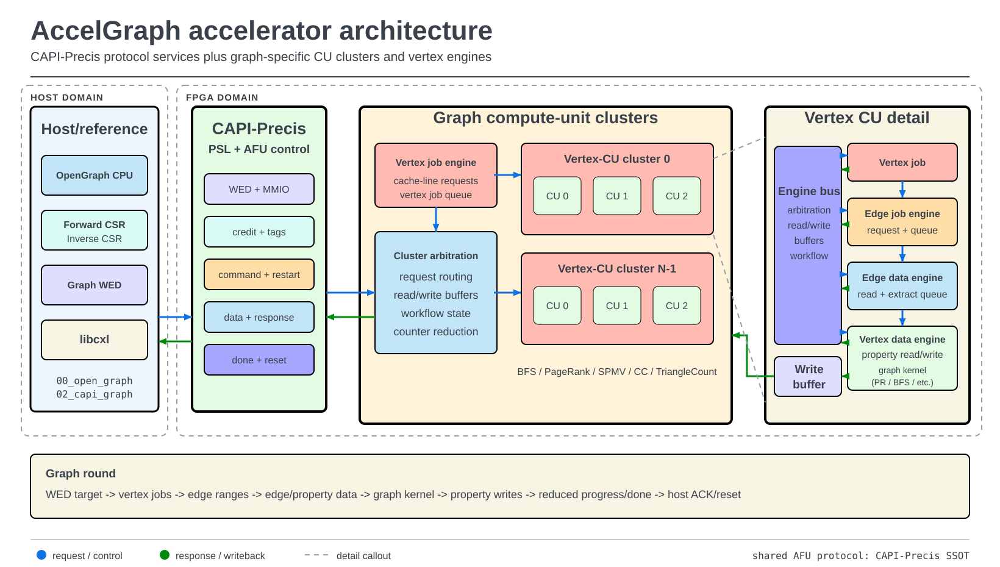
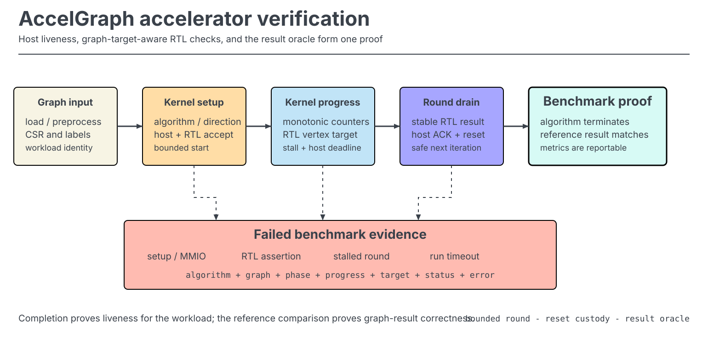

[](https://github.com/atmughrabi/AccelGraph/actions/workflows/verification.yml)
<p align="center">
  
</p>

# AccelGraph-CAPI Benchmark Suite

## Graph Processing Framework for OpenMP and CAPI

## Overview

<p align="center">
  
</p>

AccelGraph-CAPI is an open source graph processing framework. It is designed as a modular benchmarking suite for graph processing algorithms. It provides an end to end evaluation infrastructure which includes the preprocessing stage of forming the graph structure and the graph algorithm. The OpenMP part of AccelGraph-CAPI has been developed on Ubuntu 18.04, with PowerPC/Intel architecture taken into account.
AccelGraph-CAPI is coded using C giving the researcher full flexibility with modifying data structures and other algorithmic optimizations. Furthermore, this benchmarking suite has been fully integrated with IBM Coherent Accelerator Processor Interface (CAPI), demonstrating the contrast in performance between Shared Memory Accelerators and Parallel Processors.

## Deployment stability

<p align="center"></p>

AccelGraph bounds AFU/CU configuration, kernel progress, error handling, and
completion reset while retaining the existing graph-result checks. Run
`make verify` before simulator or FPGA deployment. The
[accelerator verification guide](https://github.com/atmughrabi/AccelGraph/wiki/Accelerator-Verification),
[architecture guide](https://github.com/atmughrabi/AccelGraph/wiki/Architecture),
and [verification roadmap](https://github.com/atmughrabi/AccelGraph/wiki/Verification-Infrastructure)
describe the graph-specific evidence path. The
[CAPI-Precis wiki](https://github.com/atmughrabi/CAPI-Precis/wiki) owns the
shared AFU-control contract.

The editable documentation source is the
[`docs` index](docs/README.md); the GitHub wiki is its published mirror.

# Installation

## Dependencies

### OpenMP
1. Judy Arrays
```console
AccelGraph@CAPI:~$ sudo apt-get install libjudy-dev
```
2. OpenMP is already a feature of the compiler, so this step is not necessary.
```console
AccelGraph@CAPI:~$ sudo apt-get install libomp-dev
```
3. Verilator 5 or newer is required for the standalone RTL verification target.
```console
AccelGraph@CAPI:~$ sudo apt-get install verilator
```

### CAPI
1. Simulation and Synthesis
  * This framework was developed on Ubuntu 18.04 LTS.
  * ModelSim is used for simulation and installed along side Quartus II 18.1.
  * Synthesis requires ALTERA Quartus, starting from release 15.0 of Quartus II should be fine.
  * Nallatech P385-A7 card with the Altera Stratix-V-GX-A7 FPGA is supported.
  * `tools/capi-env` delegates to the pinned CAPI-Precis harness and supplies
    AccelGraph's project, CAPI, and simulation roots. No `.bashrc` changes are
    required.
  * Initialize the recursive submodules in
    [Setting up the source code](#setting-up-the-source-code) before running
    host or simulation checks.

```bash
# Host and checkout validation
./tools/capi-env --mode host check

# Validate a ModelSim/PSLSE installation
./tools/capi-env --mode sim --intel-fpga "$HOME/intelFPGA/18.1" check

# Run with a scoped environment
./tools/capi-env --mode sim -- make run-vsim
./tools/capi-env --mode sim -- make run-pslse
./tools/capi-env --mode sim -- make run-capi-sim-verbose2

# Open a temporary configured shell; exit discards the environment
./tools/capi-env --mode synth shell
```

The [AccelGraph deployment runbook](https://github.com/atmughrabi/AccelGraph/wiki/Deployment-Runbook)
documents graph-specific launch paths. CAPI-Precis owns the canonical
[environment harness reference](https://github.com/atmughrabi/CAPI-Precis/wiki/Environment-Harness).

2. AFU Communication with PSL
  * please check [(OpenGraph)](https://github.com/atmughrabi/OpenGraph).
  * please check [(CAPI-Precis)](https://github.com/atmughrabi/CAPI-Precis).
  * please check [(CAPI User's Manual)](./06_slides/2015_CAPI.pdf).

## Setting up the source code

1. Clone AccelGraph-CAPI.
```console
AccelGraph@CAPI:~$ git clone https://github.com/atmughrabi/AccelGraph.git
```
2. From the home directory go to the AccelGraph directory:
```console
AccelGraph@CAPI:~$ cd AccelGraph/
```
3. Setup the CAPI submodules.
```console
AccelGraph@CAPI:~AccelGraph$ git submodule sync --recursive
AccelGraph@CAPI:~AccelGraph$ git submodule update --init --recursive
```

# Running AccelGraph-CAPI

## Initial compilation for the Graph framework with OpenMP

1. The default compilation is `openmp` mode:
```console
AccelGraph@CAPI:~AccelGraph$ make
```
2. From the root directory you can modify the Makefile with the [(parameters)](#accel-graph-options) you need for OpenMP:
```console
AccelGraph@CAPI:~AccelGraph$ make run
```
* OR
```console
AccelGraph@CAPI:~AccelGraph$ make run-openmp
```

## Initial compilation for the Graph framework with Coherent Accelerator Processor Interface (CAPI)

* NOTE: You need CAPI environment setup on your machine (tested on Power8 8247-22L).
* [CAPI Education Videos](https://developer.ibm.com/linuxonpower/capi/education/)
* We are not supporting CAPI-SNAP since our processing suite supports accelerator-cache. SNAP does not support this feature yet. So if you are interested in streaming applications or do not benefit from caches SNAP is also good candidate.
* To check the SNAP framework: https://github.com/open-power/snap.

### Simulation

* NOTE: You need three open terminals, for running vsim, pslse, and the application.

1. On terminal 1. Run [ModelSim vsim] for `simulation` this step is not needed when running on real hardware, this just simulates the AFU that resides on your (CAPI supported) FPGA  :
```console
AccelGraph@CAPI:~AccelGraph$ make run-vsim
```
2. The previous step will execute vsim.tcl script to compile the design, to start the running the simulation just execute the following command at the transcript terminal of ModelSim : `r #recompile design`,`c #run simulation`
```console
ModelSim> rc
```
For simulation with floating point IPs (Altera)
```console
ModelSim> rcf
```
3. On Terminal 2. Run [PSL Simulation Engine](https://github.com/ibm-capi/pslse) (PSLSE) for `simulation` this step is not needed when running on real hardware, this just emulates the PSL that resides on your (CAPI supported) IBM-PowerPC machine  :
```console
AccelGraph@CAPI:~AccelGraph$ make run-pslse
```

##### Option 1: Silent run with no stats output

4. On Terminal 3. Run the algorithm that communicates with the PSLSE (simulation):
```console
AccelGraph@CAPI:~AccelGraph$ make run-capi-sim
```

##### Option 2: Verbose run with stats output

5.  On Terminal 3. Run the algorithm that communicates with the PSLSE (simulation) printing out stats based on the responses received to the AFU-Control layer:
```console
AccelGraph@CAPI:~AccelGraph$ make run-capi-sim-verbose
```
6. Example output: please check [(CAPI User's Manual)](./06_slides/2015_CAPI.pdf), for each response explanation. The stats are labeled `RESPONSE_COMMANADTYPE_count`.
```
*-----------------------------------------------------*
|                 AFU Stats                          |
 -----------------------------------------------------
| CYCLE_count        : #Cycles                       |
*-----------------------------------------------------*
|                 Responses Stats                    |
 -----------------------------------------------------
| DONE_count               : (#) Commands successful |
 -----------------------------------------------------
| DONE_READ_count          : (#) Reads successful    |
| DONE_WRITE_count         : (#) Writes successful   |
 -----------------------------------------------------
| DONE_RESTART_count       : (#) Bus Restart         |
 -----------------------------------------------------
| DONE_PREFETCH_READ_count : (#) Read Prefetches     |
| DONE_PREFETCH_WRITE_count: (#) Write Prefetches    |
 -----------------------------------------------------
| PAGED_count        : 0                             |
| FLUSHED_count      : 0                             |
| AERROR_count       : 0                             |
| DERROR_count       : 0                             |
| FAILED_count       : 0                             |
| NRES_count         : 0                             |
| NLOCK_count        : 0                             |
*-----------------------------------------------------*

```

### FPGA

#### Synthesize

These steps require ALTERA Quartus synthesis tool, starting from release 15.0 of Quartus II should be fine.

##### Using terminal
1. From the root directory (using terminal)
```console
AccelGraph@CAPI:~AccelGraph$ make run-capi-synth
```
2. Check AccelGraph.sta.rpt for timing requirements violations

##### Using Quartus GUI
1. From the root directory (using terminal)
```console
AccelGraph@CAPI:~AccelGraph$ make run-capi-gui
```
2. Synthesize using Quartus GUI

##### Another way (using terminal)
1. From the root directory go to CAPI integration directory -> AccelGraph synthesis folder
```console
AccelGraph@CAPI:~AccelGraph$ cd 03_capi_integration/accelerator_synth/
```
2. invoke synthesis from terminal
```console
AccelGraph@CAPI:~AccelGraph/03_capi_integration/accelerator_synth$ make
```

##### Another way (using Quartus GUI)
1. From the root directory go to CAPI integration directory -> AccelGraph synthesis folder
```console
AccelGraph@CAPI:~AccelGraph$ cd 03_capi_integration/accelerator_synth/
```
2. invoke synthesis from terminal
```console
AccelGraph@CAPI:~AccelGraph/03_capi_integration/accelerator_synth$ make gui
```

#### Flashing image

1. From the root directory go to CAPI integration directory -> AccelGraph binary images:
```console
AccelGraph@CAPI:~AccelGraph$ cd 03_capi_integration/accelerator_bin/
```
2. Flash the image to the corresponding `#define DEVICE` you can modify it according to your Power8 system from `00_bench/include/capi_utils/capienv.h`
```console
AccelGraph@CAPI:~AccelGraph/03_capi_integration/accelerator_bin$ sudo capi-flash-script accel-graph_GITCOMMIT#_DATETIME.rbf
```

#### Running

##### Silent run with no stats output

1. Runs algorithm that communicates with the or PSL (real HW):
```console
AccelGraph@CAPI:~AccelGraph$ make run-capi-fpga
```

##### Verbose run with stats output

This run outputs different AFU-Control stats based on the responses received from the PSL

2. Runs algorithm that communicates with the or PSL (real HW):
```console
AccelGraph@CAPI:~AccelGraph$ make run-capi-fpga-verbose
```

# AccelGraph Options

```
-m, --afu-config=[DEFAULT:0x1]
                                                          
                             CAPI FPGA integration: AFU-Control
                             buffers(read/write/prefetcher) arbitration 0x01
                             round robin 0x10 fixed priority.

-q, --cu-config=[DEFAULT:0x01]
                                                          
                             CAPI FPGA integration: CU configurations for
                             requests cached/non cached/prefetcher active or
                             not check README for more explanation.
```
# OpenGraph Options
```
Usage: open-graph-openmp [OPTION...]
            -f <graph file> -d [data structure] -a [algorithm] -r [root] -n
            [num threads] [-h -c -s -w]

OpenGraph is an open source graph processing framework, it is designed to be a
benchmarking suite for various graph processing algorithms using pure C.

   -a, --algorithm=[DEFAULT:[0]-BFS]

                             [0]-BFS, 
                             [1]-Page-rank, 
                             [2]-SSSP-DeltaStepping,
                             [3]-SSSP-BellmanFord, 
                             [4]-DFS,
                             [5]-SPMV,
                             [6]-Connected-Components,
                             [7]-Betweenness-Centrality, 
                             [8]-Triangle Counting,
                             [9-BUGGY]-IncrementalAggregation.

  -b, --delta=[DEFAULT:1]    
                             SSSP Delta value [Default:1].

  -c, --convert-format=[DEFAULT:[1]-binary-edgeList]

                             [serialize flag must be on --serialize to write]
                             Serialize graph text format (edge list format) to
                             binary graph file on load example:-f <graph file>
                             -c this is specifically useful if you have Graph
                             CSR/Grid structure and want to save in a binary
                             file format to skip the preprocessing step for
                             future runs. 
                             [0]-text-edgeList, 
                             [1]-binary-edgeList,
                             [2]-graphCSR-binary.

  -C, --cache-size=<LLC>     
                             LLC cache size for MASK vertex reodering


  -d, --data-structure=[DEFAULT:[0]-CSR]

                             [0]-CSR, 
                             [1]-Grid, 
                             [2]-Adj LinkedList, 
                             [3]-Adj ArrayList 
                             [4-5] same order bitmap frontiers.

  -e, --tolerance=[EPSILON:0.0001]

                             Tolerance value of for page rank
                             [default:0.0001].

  -f, --graph-file=<FILE>    

                             Edge list represents the graph binary format to
                             run the algorithm textual format change
                             graph-file-format.

  -F, --labels-file=<FILE>   
                             Read and reorder vertex labels from a text file,
                             Specify the file name for the new graph reorder,
                             generated from Gorder, Rabbit-order, etc.

  -g, --bin-size=[SIZE:512]  
                             You bin vertices's histogram according to this
                             parameter, if you have a large graph you want to
                             illustrate.

  -i, --num-iterations=[DEFAULT:20]

                             Number of iterations for page rank to converge
                             [default:20] SSSP-BellmanFord [default:V-1].

  -j, --verbosity=[DEFAULT:[0:no stats output]

                             For now it controls the output of .perf file and
                             PageRank .stats (needs --stats enabled)
                             filesPageRank .stat [1:top-k results] [2:top-k
                             results and top-k ranked vertices listed.

  -k, --remove-duplicate     
                             Removers duplicate edges and self loops from the
                             graph.

  -K, --Kernel-num-threads=[DEFAULT:algo-num-threads]

                             Number of threads for graph processing kernel
                             (critical-path) (graph algorithm)

  -l, --light-reorder-l1=[DEFAULT:[0]-no-reordering]

                             Relabels the graph for better cache performance
                             (first layer). 
                             [0]-no-reordering, 
                             [1]-out-degree,
                             [2]-in-degree, 
                             [3]-(in+out)-degree, 
                             [4]-DBG-out,
                             [5]-DBG-in, 
                             [6]-HUBSort-out, 
                             [7]-HUBSort-in,
                             [8]-HUBCluster-out, 
                             [9]-HUBCluster-in,
                             [10]-(random)-degree,  
                             [11]-LoadFromFile (used for Rabbit order).

  -L, --light-reorder-l2=[DEFAULT:[0]-no-reordering]

                             Relabels the graph for better cache performance
                             (second layer). 
                             [0]-no-reordering, 
                             [1]-out-degree,
                             [2]-in-degree, 
                             [3]-(in+out)-degree, 
                             [4]-DBG-out,
                             [5]-DBG-in, 
                             [6]-HUBSort-out, 
                             [7]-HUBSort-in,
                             [8]-HUBCluster-out, 
                             [9]-HUBCluster-in,
                             [10]-(random)-degree,  
                             [11]-LoadFromFile (used for Rabbit order).

 -O, --light-reorder-l3=[DEFAULT:[0]-no-reordering]

                             Relabels the graph for better cache performance
                             (third layer). 
                             [0]-no-reordering, 
                             [1]-out-degree,
                             [2]-in-degree, 
                             [3]-(in+out)-degree, 
                             [4]-DBG-out,
                             [5]-DBG-in, 
                             [6]-HUBSort-out, 
                             [7]-HUBSort-in,
                             [8]-HUBCluster-out, 
                             [9]-HUBCluster-in,
                             [10]-(random)-degree,  
                             [11]-LoadFromFile (used for Rabbit order).

  -M, --mask-mode=[DEFAULT:[0:disabled]]

                             Encodes [0:disabled] the last two bits of
                             [1:out-degree]-Edgelist-labels
                             [2:in-degree]-Edgelist-labels or
                             [3:out-degree]-vertex-property-data
                             [4:in-degree]-vertex-property-data with hot/cold
                             hints [11:HOT]|[10:WARM]|[01:LUKEWARM]|[00:COLD]
                             to specialize caching. The algorithm needs to
                             support value unmask to work.

  -n, --pre-num-threads=[DEFAULT:MAX]

                             Number of threads for preprocessing (graph
                             structure) step 

  -N, --algo-num-threads=[DEFAULT:MAX]

                             Number of threads for graph processing (graph
                             algorithm)

  -o, --sort=[DEFAULT:[0]-radix-src]

                             [0]-radix-src, 
                             [1]-radix-src-dest, 
                             [2]-count-src,
                             [3]-count-src-dst.


  -p, --direction=[DEFAULT:[0]-PULL]

                             [0]-PULL, 
                             [1]-PUSH,
                             [2]-HYBRID. 

                             NOTE: Please consult the function switch table for each
                             algorithm.

  -r, --root=[DEFAULT:0]     
                             BFS, DFS, SSSP root

  -s, --symmetrize           
                             Symmetric graph, create a set of incoming edges.

  -S, --stats                
                             Write algorithm stats to file. same directory as
                             the graph.PageRank: Dumps top-k ranks matching
                             using QPR similarity metrics.

  -t, --num-trials=[DEFAULT:[1 Trial]]

                             Number of trials for whole run (graph algorithm
                             run) [default:1].

  -w, --generate-weights     
                             Load or Generate weights. Check ->graphConfig.h
                             #define WEIGHTED 1 beforehand then recompile using
                             this option.

  -x, --serialize            
                             Enable file conversion/serialization use with
                             --convert-format.

  -z, --graph-file-format=[DEFAULT:[1]-binary-edgeList]

                             Specify file format to be read, is it textual edge
                             list, or a binary file edge list. This is
                             specifically useful if you have Graph CSR/Grid
                             structure already saved in a binary file format to
                             skip the preprocessing step. 
                             [0]-text edgeList,
                             [1]-binary edgeList, 
                             [2]-graphCSR binary.

  -?, --help                 Give this help list
      --usage                Give a short usage message
  -V, --version              Print program version
```
# Organization

* `00_graph_bench`
  * `include` - Major function headers
    * `algorithms` - supported Graph algorithms
      * `capi`  - capi integration
        * `BFS.h`   - Breadth First Search
        * `DFS.h`   - Depth First Search
        * `SSSP.h`  - Single Source Shortest Path
        * `bellmanFord.h` - Single Source Shortest Path using Bellman Ford
        * `incrementalAgreggation.h` - Incremental Aggregation for clustering
        * `pageRank.h` - Page Rank Algorithm
        * `SPMV.h` - Sparse Matrix Vector Multiplication
  * `src` - Major function Source files
    * `algorithms` - supported Graph algorithms
      * `capi`  - CAPI integration
        * `BFS.c`   - Breadth First Search
        * `DFS.c`   - Depth First Search
        * `SSSP.c`  - Single Source Shortest Path
        * `bellmanFord.c` - Single Source Shortest Path using Bellman Ford
        * `incrementalAgreggation.c` - Incremental Aggregation for clustering
        * `pageRank.c` - Page Rank Algorithm
        * `SPMV.c` - Sparse Matrix Vector Multiplication

* *`Makefile`* - Global makefile

# Tasks TODO:

- [x] Finish integration with CAPI Simulation
- [x] Finish integration with CAPI Cache
- [x] Finish Synthesis with CAPI (Meets time requirements)
- [ ] Finish graph algorithms suite CAPI
  - [x] BFS   (Breadth First Search)
  - [x] PR    (Page-Rank)
  - [x] DFS   (Depth First Search) `(work in progress)`
  - [ ] IA    (Incremental Aggregation) (Needs Atomic Operation -> CAPI v2.0)
  - [ ] SSSP  (BellmanFord) (Needs Atomic Operation -> CAPI v2.0)
  - [ ] SSSP  (Dijkstra) (Needs Atomic Operation -> CAPI v2.0)
  - [x] CC    (Connected Components)
  - [x] TC    (Triangle Counting) `(work in progress)`
  - [x] SPMV  (Sparse Matrix-vector Multiplication)
  - [x] BC    (Betweenness Centrality) `(work in progress)`
- [x] Support testing
Report bugs to <atmughra@ncsu.edu>
Report bugs to <atmughra@ncsu.edu>
